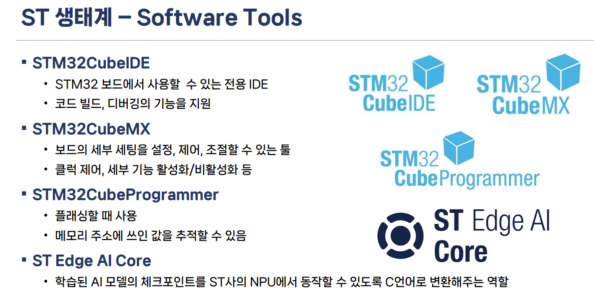
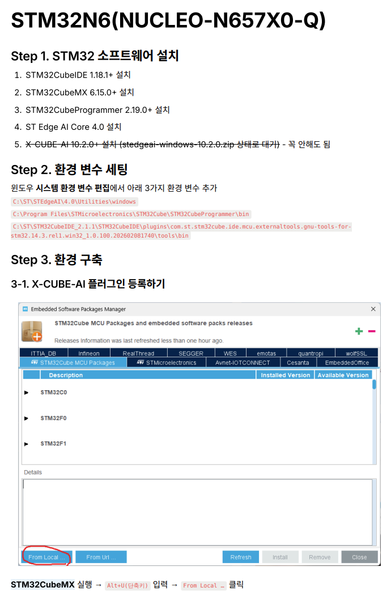

# 🚀 STM32N6(NUCLEO-N657X0-Q) NPU 가속(시계열) 가이드 

_Accelerate Time-series deep learning model on STM32N6(NUCLEO-N657X0-Q) - Korean Guide_

  
  
  

## 📌 여기는 어디?
이 저장소는 **STM32N6(NUCLEO-N657X0-Q)** 환경에서 **시계열 모델**을 **NPU 가속** 하려는 개발자들에게 가이드를 주기 위한 저장소입니다.   
직접 **뚜드러 맞아가며** 정리를 해봤는데, 도움이 되면 좋겠네요.😊

---

## 📂 가이드 문서 안내

| 구분 | 문서명 및 주요 내용 | 문서 미리보기 |
| :---: | :--- | :---: |
| **기본 가이드** | **`(NUCLEO-N657X0-Q)-NPU_Acceleration_Guide(KR).pdf`**  • STMicroelectronics 생태계 쉽게 이해하기 • NPU 가속이 어떤 흐름으로 진행되는지 전체적인 프로세스 맛보기 | <kbd></kbd> ▲ 기본 가이드 주요 내용 |
| **심화 가이드** | **`(NUCLEO-N657X0-Q)-NPU_Acceleration_Guide(KR_Detailed).pdf`**  • NPU 가속을 실제로 내 프로젝트에 구현하는 구체적인 방법 • 그대로 따라 하면 성공하는 상세한 개발 단계와 설정 과정 기록 | <kbd></kbd> ▲ 상세 가이드 주요 내용 |

---

## 💡 참고해 주세요! (Notice)

> [!NOTE]
> **최종 소스 코드 적용 안내**
> 이 저장소에 올라와 있는 코드는 상세 가이드 문서(`KR_Detailed.pdf`)에 적힌 **모든 설정과 최적화 과정을 마친 최종 완성본**입니다. 가이드를 먼저 차근차근 따라 가보시면 도움이 될 것이라 믿습니다.

> [!IMPORTANT]
> **⚠️ 시계열 모델 가속 시 필수 체크 (삽질 방지)**  
> 이 보드는 태생이 Vision Task(이미지 처리)용이라 시계열 모델을 올릴 때 **2D Convolution을 수행하는 모델만 NPU 가속이 가능**한 것으로 생각됩니다.
> 
> * **🩸 삽질 기록:** 처음에는 1D CNN(TCN 등)부터 시작해서 LSTM, Transformer 계열 모델까지 전부 올려봤으나... NPU 가속 단계에서 장렬히 실패했습니다. (진짜 다 해봤는데 안 되더라고요 🥲, 애초에 탑재된 CPU만으로도 충분히 빠르기도 하구요...)
> * **💡 2D Conv가 답:** 혹시나 하는 마음에 2D Conv 레이어로 모델 구조를 새로 짜서 가속에 성공했습니다. 혹시 제가 실패한 아키텍처로 STM32N6 가속에 성공하신 고수분이 계신다면 Issue나 PR로 제보 부탁드립니다! (메일도 가능 : 1047piclab@gmail.com)
